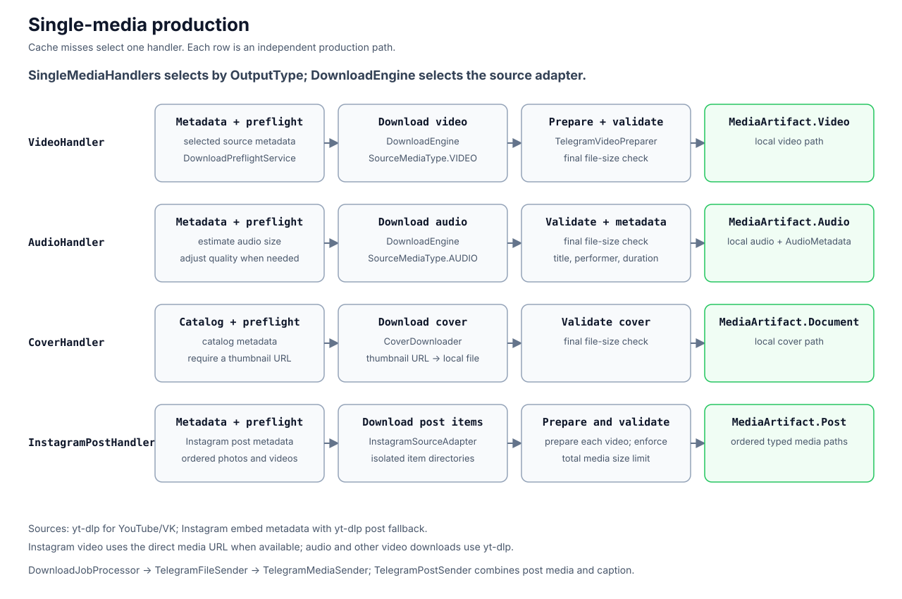
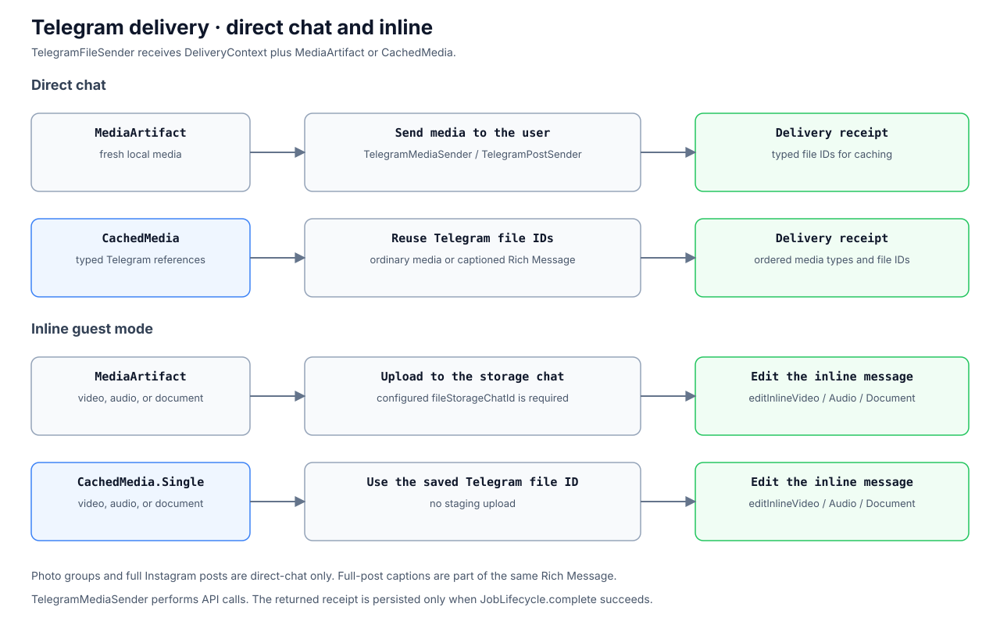
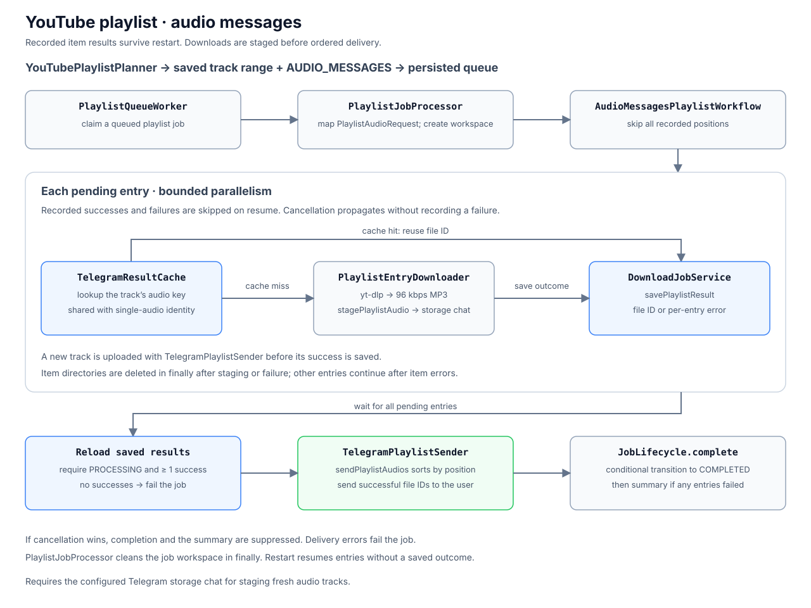
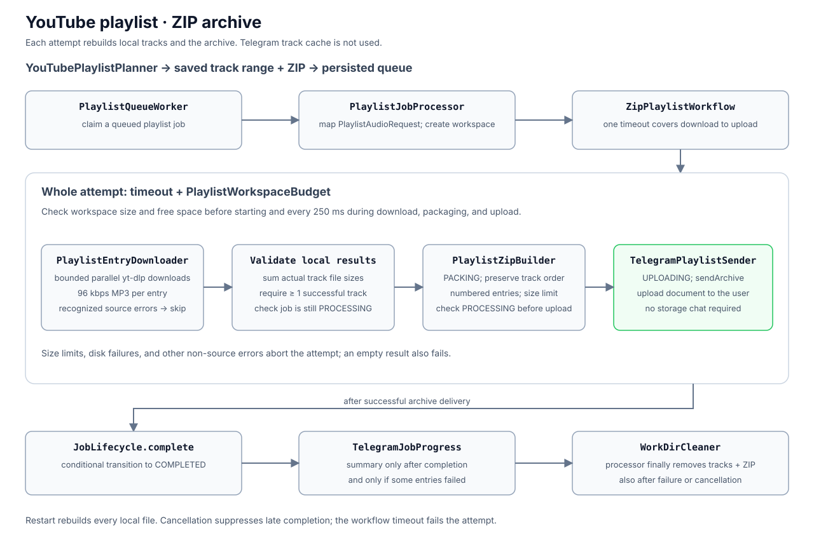
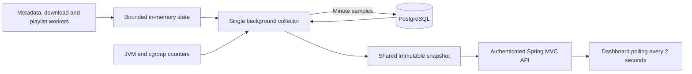

# Kradnik

Kradnik retrieves public media from YouTube, Instagram, and VK and delivers it directly in Telegram.

It supports:

- video quality selection, audio-only downloads, and cover images;
- YouTube playlist audio as 96 kbps MP3, delivered in Rich Messages of up to 50 tracks or a ZIP archive, up to 100 tracks per job;
- full Instagram posts with an image, video, or mixed carousel and its caption in one Telegram Rich Message;
- direct chats and inline guest mode; playlists and full Instagram posts are available only in direct chats;
- cancellation of queued and running downloads;
- English and Russian interfaces;
- Telegram `file_id` reuse and cloud or local Bot API delivery (Bot API 10.2 or newer for Rich Messages).

Playlist video downloads, playlists from other platforms, private content, and authentication bypasses are not supported.

## Request flow


The diagram shows the single-media path. Playlist jobs use `PlaylistQueueWorker` and `PlaylistJobProcessor` with the same persisted queue and job states.

`DownloadChoicePlanner` routes planning to the standard media, Instagram, or YouTube playlist planner. Standard and Instagram options share `MediaChoiceBuilder`; `DownloadEngine` delegates source metadata and downloads to explicit yt-dlp and Instagram adapters.

`TelegramUpdateHandler` validates and routes links and inline queries. `DownloadChoiceCoordinator` runs the bounded metadata task, persists the choice session, and publishes the menu. The saved `DownloadSpec` contains the selected format, source arguments, output type, and cache identity. `DownloadChoiceHandler` accepts a saved selection, and `TelegramDownloadStarter` creates a queued job through `DownloadJobService`. `DownloadQueueWorker` atomically claims it as `PROCESSING`.

- Metadata is loaded before enqueueing to build the available format menu and estimate sizes.
- Metadata work uses 2 threads and accepts at most 32 pending requests.
- YouTube playlists offer audio messages or ZIP for all tracks when there are at most 100 entries; larger playlists offer the first 100 or last 100. Both delivery modes use 96 kbps MP3.
- ZIP archives are named `<file count> – <playlist title>.zip`; numbered entries preserve playlist order. The count includes only successfully downloaded tracks. Archives exceeding the configured Telegram upload limit are rejected without splitting.
- Instagram videos keep the video/audio menu and add a full-post option; static posts and carousels expose one full-post option. Up to 20 ordered photos/videos are supported. Native Instagram music that is absent from public metadata is not downloaded; no Instagram login is used.
- Download buttons use blue for full posts/video, green for audio, the theme default for covers/ZIP, and red for cancellation. Unavailable options keep the default style.
- Menu snapshots, ownership, and language preferences are stored in PostgreSQL, so callbacks survive restarts.

### Single-media production

`DownloadRequestMapper` reads the saved selection into `SingleMediaRequest`. `DownloadJobProcessor` checks `TelegramResultCache` first. On a miss, it creates a workspace and selects a handler through `SingleMediaHandlers`. An invalid cached Telegram file reference falls back to a fresh download; other delivery errors fail the job.

`SingleMediaHandlers` selects by `OutputType`; each row below is an independent production path. `DownloadEngine` selects the source adapter, using yt-dlp for YouTube/VK and the Instagram adapter for Instagram. `DeliveryContext` carries the Telegram destination and post text through delivery.



| Handler | Production and validation | Result |
| --- | --- | --- |
| `VideoHandler` | Metadata and preflight, source video download, `TelegramVideoPreparer`, final size check | `MediaArtifact.Video` |
| `AudioHandler` | Metadata and audio preflight, quality adjustment when needed, source audio download, final size check | `MediaArtifact.Audio` with title, performer, and duration |
| `CoverHandler` | Catalog metadata and preflight, required thumbnail URL, `CoverDownloader`, final size check | `MediaArtifact.Document` |
| `InstagramPostHandler` | Metadata and preflight, ordered Instagram photo/video downloads in isolated item directories, per-video preparation, total media size bounded by the configured Telegram upload limit | `MediaArtifact.Post` |
| `ImagesHandler` | Instagram image metadata and ordered downloads with per-photo limits; no aggregate single-file size check | `MediaArtifact.Photos` |

Audio preflight still checks selected source sizes when duration-based estimation is unavailable. `InstagramSourceAdapter` uses embed metadata, falling back to yt-dlp post metadata when the embed is unavailable. Carousel fallback downloads select one position at a time. It downloads video directly when a media URL is available; audio and video without that URL use yt-dlp.

### Telegram delivery



`TelegramFileSender` delivers fresh `MediaArtifact` results or typed `CachedMedia` references using `DeliveryContext`. Full posts are delivered by `TelegramPostSender` as one Rich Message with a caption and ordered media; cached posts retain each media type and file ID. Fresh inline results are uploaded to the configured storage chat before the inline message is edited; cached inline results reuse the file ID directly. Photo groups and full Instagram posts are direct-chat only. `TelegramMediaSender` owns ordinary media API calls; the processor passes the delivery receipt to `JobLifecycle`.

Fresh artifacts hold local file paths; cached media hold Telegram file references. Inline delivery supports video, audio, and documents through the corresponding inline-edit methods. The delivery receipt contains the reusable file IDs, including ordered media types for full posts, and is persisted only if `JobLifecycle.complete` succeeds.

### Playlist audio messages



`PlaylistJobProcessor` maps the persisted job to `PlaylistAudioRequest` and selects `AudioMessagesPlaylistWorkflow`. The workflow skips recorded positions, including failures, and processes remaining tracks with bounded parallelism. It reuses cached audio or downloads 96 kbps MP3 through `PlaylistEntryDownloader` and stages it with `TelegramPlaylistSender` in the storage chat.

The saved playlist selection contains the track range prepared by `YouTubePlaylistPlanner` and the `AUDIO_MESSAGES` delivery mode; `PlaylistQueueWorker` claims the job after enqueueing. Track cache keys share the single-audio identity. A fresh track is uploaded to the configured storage chat before `DownloadJobService.savePlaylistResult` records its file ID.

Each item saves a file ID or an error before its temporary directory is removed. Once all pending entries finish, the workflow checks that the job is still processing, reloads saved results, and delivers successful tracks in playlist order, with up to 50 audio blocks per Rich Message (100 tracks produce two messages). No successful tracks means failure. A summary of skipped tracks is sent only after conditional completion succeeds. Restart resumes entries without a recorded outcome; user cancellation propagates without recording a new item failure.

Item directories are removed in `finally` after staging or failure; other entries continue after individual item errors. Delivery errors fail the job. Cancellation suppresses late completion and the summary, and the processor cleans the job workspace in `finally`.

### Playlist ZIP



`ZipPlaylistWorkflow` downloads tracks with bounded parallelism, packages successful local files with `PlaylistZipBuilder`, and sends the archive directly through `TelegramPlaylistSender`. This path does not reuse Telegram track file IDs or require a storage chat. Every attempt rebuilds local files, including after restart.

Planning saves the selected track range and `ZIP` delivery mode. `PlaylistQueueWorker` claims the job, and `PlaylistJobProcessor` maps it to `PlaylistAudioRequest` and creates the workspace. `PlaylistEntryDownloader` produces a local 96 kbps MP3 for each successful entry. Packaging reports the `PACKING` phase; archive delivery reports `UPLOADING` and sends a document to the user.

One timeout covers downloading, packaging, and uploading; exceeding it fails the attempt. `PlaylistWorkspaceBudget` checks workspace size and free space before starting and every 250 ms throughout the attempt; the sum of downloaded track sizes and the final archive must each fit the upload limit. Recognized source failures skip individual tracks; size limits, disk failures, and other non-source errors abort the job. An empty result also fails. State checks precede packaging and upload, conditional completion precedes the partial-success summary, and the processor cleans all local files in `finally`, including after failure or cancellation.

### Runtime models and cache

`DownloadJob` remains the persistence model and `DownloadSpec` the stored menu snapshot. Runtime requests separate single-media and playlist data; `SourceRequest` contains source download options. `ResultKeyFactory` centralizes result identities, while `TelegramReceiptCodec` preserves the stored file-ID and photo-group formats and keeps playlist completion markers separate from cached media. Existing queued selections and keys are read without reconstruction or re-versioning.

## Queue and lifecycle

- The application runs as a single instance.
- `DOWNLOAD_WORKERS` controls single-media worker loops; the default is 3.
- `DOWNLOAD_PLAYLIST_WORKERS` controls a separate pool of playlist worker loops; the default is 1, in addition to the single-media workers.
- Each playlist downloads up to `DOWNLOAD_PLAYLIST_ITEM_PARALLELISM` tracks concurrently; the default is 2.
- Pending jobs stay in PostgreSQL. Workers claim them with `FOR UPDATE SKIP LOCKED` and `UPDATE ... RETURNING`.
- Claiming and state changes use short transactions; download and Telegram upload I/O run outside them.
- Job states are `QUEUED`, `PROCESSING`, `COMPLETED`, `FAILED`, and `CANCELLED_BY_USER`.
- Both processors use `JobLifecycle` for conditional completion and failure through `DownloadJobService`. A cancelled job cannot be completed or failed by a late result; the playlist summary is sent only when completion succeeds.
- Handlers and workflows report `JobProgress` phases. `TelegramJobProgress` maps phases and semantic `DownloadFailure` reasons to Telegram statuses; processors own cancellation handling and workspace cleanup in `finally`.
- Failed jobs are not retried automatically; users can submit the link again. A playlist can complete with partial results when individual tracks fail.
- Startup removes abandoned work directories and returns `PROCESSING` jobs to `QUEUED`.
- Shutdown interrupts external I/O and waits up to 30 seconds for each worker pool.
- Interrupted jobs are retried after restart. Audio-message playlists retain recorded Telegram file IDs and process remaining entries; ZIP playlists rebuild from scratch because their local files are temporary.
- A crash after Telegram accepts a file but before `COMPLETED` can produce a duplicate message.
- Overlapping application instances are not supported.

## Embedded admin dashboard

The monitoring dashboard runs in the bot JVM and container. Spring MVC serves local HTML/CSS/JavaScript; no frontend build, CDN, Node process, WebSocket server, or metrics service is required. The responsive layout supports phones; wide tables scroll inside their panels. A centered login form uses Spring Security sessions and a BCrypt password hash. The dashboard and its API require authentication.



Enable it with `ADMIN_ENABLED=true`, `ADMIN_USERNAME`, and `ADMIN_PASSWORD_HASH`. The hash must use BCrypt cost 10–14. Generate a hash interactively with `htpasswd -nBC 10 admin` where available, then copy only the hash after `admin:`. When using a Compose `.env` file, single-quote the hash to preserve its `$` characters. Never commit credentials or pass plaintext passwords on a command line.

Compose publishes `127.0.0.1:${ADMIN_PUBLIC_PORT:-8080}` on the host. Open `/admin` through an SSH tunnel, for example `ssh -L 8080:127.0.0.1:8080 user@server`, or an existing HTTPS reverse proxy. For HTTPS, set `ADMIN_COOKIE_SECURE=true`; ordinary HTTP access with secure cookies will not keep the login session. Native non-Compose runs can set `ADMIN_PORT` (default 8080). The web listener remains present when `ADMIN_ENABLED=false`, but access is denied and the collector/database pool are not created. Blank or invalid credentials prevent startup when the dashboard is enabled.

Sessions expire after 15 minutes of inactivity and allow at most three concurrent logins. Cookies are HttpOnly and SameSite=Strict; CSRF protection covers login and logout. A global in-memory limit allows ten login submissions per minute. It deliberately does not trust client-supplied forwarding headers. Active dashboard polling keeps a session active; use logout when finished. Credential changes require a restart.

The dashboard shows:

- Logical worker slots for metadata preparation, single downloads, and playlists: idle, busy, backoff after a loop error, or stopped; current job, platform, phase and elapsed time where applicable. Playlist track activity and waiting tracks are separate from parent jobs.
- Persisted queued/processing job counts and the oldest queued job by workload. Metadata preparation has its own bounded in-memory queue. A long-running task is not automatically classified as stuck.
- Completed, failed and user-cancelled jobs over rolling 15-minute, one-hour and 24-hour windows. These values use PostgreSQL `completed_at`; a partially successful playlist still counts as completed.
- Persisted error counts for metadata preparation, playlist items, worker iterations and metadata queue rejection. These minute-resolution counters survive releases and overlap with failed jobs; do not sum them into a single failure total. They do not represent every application log error.
- Up to one hour of queue history, with one sample per minute; the current minute updates live. Saved samples are restored after restart.

All three tables support sorting by column headers (click, Enter or Space). Repeated activation reverses the direction; each table keeps its selection during polling and period changes. Sorting runs entirely in the browser: counts, job IDs and elapsed times use their underlying numeric values, missing values stay last, and playlist tracks sort by active count then waiting count.

Memory monitoring reads JVM MXBeans and the process's Linux memory cgroup (v1/v2) in the existing collector, at most once every five seconds (normally every six seconds with its two-second tick). It adds no worker hooks, thread, dependency, object traversal, forced GC or remote monitoring service. The dashboard shows heap used/committed/max, non-heap total with metaspace/code cache, cgroup usage/limit, and rolling GC count/time deltas. GC time is the JVM's approximate accumulated collection time, not an exact application-pause measurement; startup and collection gaps show the actual measured window. Unsupported counters are unavailable, not zero. Cgroup usage includes child processes such as yt-dlp/ffmpeg and charged file cache; it is not JVM RSS or total VPS usage. The displayed limit belongs to the visible memory cgroup; limits of hidden ancestor groups cannot be detected. Missing or unlimited limits do not produce a percentage.

V34 adds memory minute samples with seven-day retention. The UI restores up to one hour of heap/cgroup history across releases, with gaps left visible. Completed minute samples are written once per minute through the same bounded admin database connection; graceful shutdown also flushes the current minute. Buffered samples are bounded to one hour during outages. An abrupt stop can lose the unfinished minute and samples since the last successful write. Memory acquisition and persistence failures are reported separately, and cannot block bot workers; the collector, JVM and database still consume shared VPS resources.

`download_jobs` remains the source of truth for queue state and completed job outcomes; these values are not duplicated in a separate event log. `AdminStatisticsStore` persists only information unavailable from that table: additional error counters and historical queue-length samples.

One collector refreshes queue aggregates every two seconds after the previous collection finishes, and outcome aggregates at most once per ten seconds. Requests read the cached snapshot without SQL. The collector owns one separate PostgreSQL connection at most, shared by dashboard reads and aggregate writes, with a 500 ms statement timeout, 100 ms lock timeout, 500 ms connection acquisition timeout and bounded socket/connect timeouts. V33 adds partial indexes for active and terminal jobs and two small aggregate tables. If a query fails or times out, the previous values remain visible with their last successful update time; missing values are not reported as zero. Very large recent histories can exceed the query budget and require a later aggregation design.

Backend instrumentation depends only on the `BotTelemetry` execution contract, not on controllers, dashboard DTOs, JPA entities or web configuration. Its integration points are the two queue loops, metadata execution, `JobProgressFactory` for all phase changes, and `PlaylistItems` for both playlist delivery modes. Platform adapters and media handlers do not know about the admin. `AdminQueries` isolates the dashboard's two job-table SQL projections from repository implementation changes; schema migrations affecting their columns must update these projections and their PostgreSQL integration tests. The browser consumes only `DashboardSnapshot`.

Additional counters are flushed at most once every ten seconds and again after workers stop on graceful shutdown. Per-process absolute minute counts make retries idempotent, even if a database response is lost after commit. Queue samples are upserted by minute. Aggregate rows are retained for seven days and pruned hourly; the UI currently displays error windows up to 24 hours and queue history for one hour. Live worker states are rebuilt after restart. An abrupt process/container loss can discard counters since the last successful flush (normally about ten seconds; longer during database outages). Persistence outages keep pending counters in a bounded 24-hour memory window and are indicated on the dashboard; they do not block workers.

Worker instrumentation only updates bounded memory; it performs no database or network I/O. The web server is limited to eight request threads and 32 connections. Hidden browser tabs pause polling; failed requests use bounded exponential backoff. Browser payloads exclude source URLs, Telegram identities, credentials and exception messages. CPU, heap and GC remain shared with the bot.

## Code map

Paths are relative to `src/main/kotlin/com/nkudrin713/kradnik/`.

| Component | Responsibility |
| --- | --- |
| `telegram/handler/TelegramUpdateHandler.kt` | Commands, links, and callbacks |
| `download/platform/PlatformResolver.kt` | URL validation, normalization, and source routing |
| `download/choice/DownloadChoicePlanner.kt`, `StandardMediaChoicePlanner.kt`, `InstagramChoicePlanner.kt`, `MediaChoiceBuilder.kt` | Planning routing, platform-specific options, shared format selection and size estimates |
| `telegram/DownloadChoiceCoordinator.kt` | Bounded metadata execution and menu publication |
| `download/service/DownloadJobService.kt` | Enqueue, claim, completion, failure, cancellation, and startup recovery |
| `download/repository/DownloadJobRepository.kt` | Queue SQL and reusable Telegram file lookup |
| `download/processing/DownloadQueueWorker.kt` | Single-media worker pool and polling loops |
| `download/processing/DownloadJobProcessor.kt` | Cache lookup, handler selection, delivery, lifecycle, and cleanup |
| `download/single/` | Video, audio, cover, and images production through `SingleMediaHandler` |
| `download/domain/DownloadRequest.kt`, `MediaArtifact.kt`, `MediaMetadata.kt` | Runtime requests, typed local results, and source-neutral metadata |
| `download/repository/DownloadRequestMapper.kt` | Saved menu/job selection to runtime request mapping |
| `download/playlist/YouTubePlaylistPlanner.kt` | Playlist metadata, track ranges, and audio options |
| `download/processing/PlaylistQueueWorker.kt`, `download/processing/PlaylistJobProcessor.kt` | Separate playlist workers and delivery-mode orchestration |
| `download/playlist/AudioMessagesPlaylistWorkflow.kt`, `ZipPlaylistWorkflow.kt` | Track processing, checkpoints or ZIP packaging, and playlist delivery |
| `download/playlist/PlaylistWorkspaceBudget.kt` | ZIP workspace size and free-space checks |
| `download/processing/JobLifecycle.kt`, `download/telegram/TelegramJobProgress.kt` | Conditional terminal transitions, progress, user-facing errors, and playlist summaries |
| `download/processing/ActiveDownloadRegistry.kt` | Running coroutine registry for user cancellation |
| `download/DownloadEngine.kt`, `download/source/` | Explicit source registry, source requests, metadata adaptation, and yt-dlp/Instagram download routing |
| `download/instagram/InstagramEmbedDownloader.kt` | Instagram metadata and media download |
| `ytdlp/YtDlpService.kt`, `ytdlp/YtDlpPresets.kt`, `process/DefaultProcessRunner.kt` | Download presets, external commands, timeouts, diagnostics, and process termination |
| `download/telegram/TelegramFileSender.kt`, `TelegramPlaylistSender.kt`, `telegram/TelegramMediaSender.kt` | Single-media and playlist delivery through the Telegram API |
| `download/telegram/TelegramResultCache.kt`, `TelegramReceiptCodec.kt`, `download/identity/ResultKeyFactory.kt` | Cache lookup, stored Telegram references, and result keys |
| `download/limit/`, `download/cover/` | Preflight/upload limits and cover downloads |
| `download/video/` | Video probing and Telegram compatibility normalization |

Runtime ownership:

- PostgreSQL stores jobs, choice sessions, and user language preferences.
- Flyway owns schema changes.
- HTTP clients are shared. Planning reads metadata before enqueueing; single-media cache misses prepare it again for preflight and download. Download processes and work directories belong to a job or playlist entry.
- PostgreSQL owns job state; `ActiveDownloadRegistry` holds running coroutine handles in memory so cancellation can reach active I/O.

## Stack

- Application: Kotlin, Spring Boot, Spring Data JPA, Java 21 executors.
- Storage: PostgreSQL and Flyway.
- Media: yt-dlp, ffmpeg, and ffprobe.
- Delivery: Telegram Bot API.
- Deployment: Docker Compose.
- Tests: JUnit, MockK, JaCoCo, and Testcontainers.
- I/O model: executor worker loops bridge to coroutines for job cancellation, parallel playlist processing, and external I/O.

## Local development

Requirements: Java 21, Docker, yt-dlp, ffmpeg/ffprobe, Deno for YouTube JavaScript challenges, and a Telegram bot token. See `Dockerfile` for the packaged media dependencies.

```bash
cp .env.example .env
# Set TELEGRAM_BOT_TOKEN in .env
APP_IMAGE=kradnik:local docker compose up -d postgres
./gradlew bootRun --args='--spring.profiles.active=local'
```

Run the complete verification:

```bash
./gradlew check bootJar
```

- `check` runs ktlint, tests, and aggregate JaCoCo coverage verification.
- PostgreSQL integration tests use Testcontainers and are skipped when Docker is unavailable.
- A successful build with skipped Testcontainers tests is not database verification.

## Configuration

- `POSTGRES_*`: database connection.
- `TELEGRAM_BOT_*`, `TELEGRAM_MAX_UPLOAD_BYTES`: Telegram endpoints and file-size limit.
- `TELEGRAM_FILE_STORAGE_CHAT_ID`: storage chat for fresh guest-mode uploads and playlist audio messages; ZIP delivery does not require it.
- `DOWNLOAD_WORKERS`: concurrent single-media jobs; default 3.
- `DOWNLOAD_PLAYLIST_WORKERS`: additional concurrent playlist jobs; default 1.
- `DOWNLOAD_PLAYLIST_ITEM_PARALLELISM`: concurrent track downloads inside one playlist; default 2.
- `DOWNLOAD_PLAYLIST_ZIP_TIMEOUT`: total ZIP job timeout, including download, packaging and upload; default `2h`. ZIP workspaces are monitored against three times `TELEGRAM_MAX_UPLOAD_BYTES` and require at least 64 MiB of free disk space. The polling guard may briefly overshoot while external processes write.
- `DOWNLOAD_WORK_DIR`: writable media directory with one subdirectory per job.
- `DOWNLOAD_*_TIMEOUT`: external-process and HTTP timeouts.
- `DOWNLOAD_YT_DLP_CLOUD_MAX_WORKSPACE_BYTES`: per-process cloud download workspace cap.
- `DOWNLOAD_CHOICE_SESSION_TTL`: retention after selection or cancellation; default 30 minutes.
- `DOWNLOAD_CHOICE_SESSION_MAX_AGE`: maximum lifetime of an unselected menu; default 30 days.
- `DOWNLOAD_CHOICE_SESSION_CLEANUP_DELAY_MS`: cleanup interval; default 600000 ms.
- `YOUTUBE_PO_TOKEN_PROVIDER_URL`: optional YouTube PO Token Provider.

Operational notes:

- Local Bot API endpoints require a media volume shared with the application; point `DOWNLOAD_WORK_DIR` to it.
- Guest mode requires BotFather enablement and permission to use the configured storage chat.
- Audio-message playlists also require access to the storage chat for uploading new tracks before ordered delivery; ZIP playlists upload the archive directly.
- Cached `file_id` values do not need an intermediate upload.
- `/language` changes the persisted user language.

## Docker and releases

```bash
./gradlew bootJar
mkdir -p .deploy
cp build/libs/app.jar .deploy/app.jar
docker build -t kradnik:local .
APP_IMAGE=kradnik:local docker compose up -d
```

- The image includes yt-dlp, ffmpeg, and runtime dependencies.
- Compose profiles `telegram-local` and `youtube-pot` enable optional services.
- `scripts/render-deploy-env.sh` renders production configuration.
- Merging to `main` does not deploy. A manual release builds and deploys an immutable version and image digest.
- Migration `V26` requires the old application to be stopped; mixed versions and application-only rollback are unsafe.
- Applied Flyway migrations are immutable.
