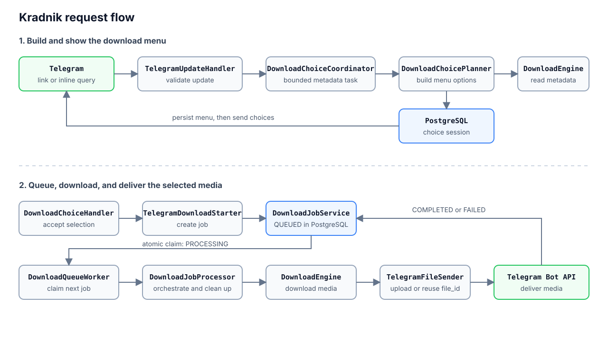

# Kradnik

Kradnik retrieves public media from YouTube, Instagram, and VK and delivers it directly in Telegram.

It supports:

- video quality selection, audio-only downloads, and cover images;
- every photo from a static Instagram post or carousel, sent as Telegram photo albums;
- direct chats and inline guest mode; Instagram photo sets are available only in direct chats;
- English and Russian interfaces;
- Telegram `file_id` reuse and cloud or local Bot API delivery.

Source playlists, private content, and authentication bypasses are not supported.

## Request flow



- Metadata is loaded before enqueueing to build the available format menu and estimate sizes.
- Metadata work uses 2 threads and accepts at most 32 pending requests.
- Instagram videos keep the video/audio menu; static posts expose one option for all images in post order.
- Menu snapshots, ownership, and language preferences are stored in PostgreSQL, so callbacks survive restarts.

## Queue and lifecycle

- The application runs as a single instance.
- `DOWNLOAD_WORKERS` controls the number of worker loops; the default is 3.
- Pending jobs stay in PostgreSQL. Workers claim them with `FOR UPDATE SKIP LOCKED` and `UPDATE ... RETURNING`.
- Claiming and state changes use short transactions; download and Telegram upload I/O run outside them.
- Job states are `QUEUED`, `PROCESSING`, `COMPLETED`, and `FAILED`.
- Failures are terminal; users can submit the link again.
- Startup removes abandoned work directories and returns `PROCESSING` jobs to `QUEUED`.
- Shutdown cancels external I/O and waits up to 30 seconds for workers.
- Delivery is at least once across crashes.
- A crash after Telegram accepts a file but before `COMPLETED` can produce a duplicate message.
- Overlapping application instances are not supported.

## Code map

Paths are relative to `src/main/kotlin/com/nkudrin713/kradnik/`.

| Component | Responsibility |
| --- | --- |
| `telegram/handler/TelegramUpdateHandler.kt` | Commands, links, and callbacks |
| `download/platform/PlatformResolver.kt` | URL validation, normalization, and source routing |
| `download/choice/DownloadChoicePlanner.kt` | Format and size menu options |
| `telegram/DownloadChoiceCoordinator.kt` | Bounded metadata execution and menu publication |
| `download/service/DownloadJobService.kt` | Enqueue, claim, completion, failure, and startup recovery |
| `download/repository/DownloadJobRepository.kt` | Queue SQL and reusable Telegram file lookup |
| `download/processing/DownloadQueueWorker.kt` | Worker pool and polling loops |
| `download/processing/DownloadJobProcessor.kt` | Download-to-delivery flow and cleanup |
| `download/DownloadEngine.kt` | yt-dlp, Instagram video/image, and cover branches |
| `download/instagram/InstagramEmbedDownloader.kt` | Instagram metadata and media download |
| `ytdlp/client/YtDlpService.kt`, `process/DefaultProcessRunner.kt` | External commands, timeouts, diagnostics, and process termination |
| `download/telegram/TelegramFileSender.kt`, `telegram/TelegramMediaSender.kt` | Telegram delivery, cached files, and photo albums |
| `download/video/` | Video probing and Telegram compatibility normalization |

Runtime ownership:

- PostgreSQL stores jobs, choice sessions, and user language preferences.
- Flyway owns schema changes.
- HTTP clients are shared; metadata, processes, and work directories belong to one job.
- Running jobs are not tracked in a shared mutable collection.

## Stack

- Application: Kotlin, Spring Boot, Spring Data JPA, Java 21 executors.
- Storage: PostgreSQL and Flyway.
- Media: yt-dlp, ffmpeg, and ffprobe.
- Delivery: Telegram Bot API and Docker Compose.
- Tests: JUnit, MockK, JaCoCo, and Testcontainers.
- I/O model: coroutines remain inside external adapters for cancellation and process stream handling.

## Local development

Requirements: Java 21, Docker, yt-dlp, ffmpeg, and a Telegram bot token.

```bash
cp .env.example .env
# Set TELEGRAM_BOT_TOKEN in .env
docker compose up -d postgres
./gradlew bootRun --args='--spring.profiles.active=local'
```

Run the complete verification:

```bash
./gradlew check bootJar
```

- `check` runs tests and verifies aggregate JaCoCo coverage.
- PostgreSQL integration tests use Testcontainers and are skipped when Docker is unavailable.
- A successful build with skipped Testcontainers tests is not database verification.

## Configuration

- `POSTGRES_*`: database connection.
- `TELEGRAM_BOT_*`, `TELEGRAM_MAX_UPLOAD_BYTES`: Telegram endpoints and file-size limit.
- `TELEGRAM_FILE_STORAGE_CHAT_ID`: private storage chat for fresh guest-mode uploads.
- `DOWNLOAD_WORKERS`: concurrent download jobs; default 3.
- `DOWNLOAD_WORK_DIR`: writable media directory with one subdirectory per job.
- `DOWNLOAD_*_TIMEOUT`: external-process and HTTP timeouts.
- `DOWNLOAD_YT_DLP_CLOUD_MAX_WORKSPACE_BYTES`: per-process cloud download workspace cap.
- `DOWNLOAD_CHOICE_SESSION_*`: menu retention.
- `YOUTUBE_PO_TOKEN_PROVIDER_URL`: optional YouTube PO Token Provider.

Operational notes:

- Local Bot API endpoints require a media volume shared with the application; point `DOWNLOAD_WORK_DIR` to it.
- Guest mode requires BotFather enablement and permission to use the configured storage chat.
- Cached `file_id` values do not need an intermediate upload.
- `/language` changes the persisted user language.

## Docker and releases

```bash
./gradlew bootJar
mkdir -p .deploy
cp build/libs/app.jar .deploy/app.jar
docker build -t kradnik:local .
APP_IMAGE=kradnik:local docker compose up -d
```

- The image includes yt-dlp, ffmpeg, and runtime dependencies.
- Compose profiles `telegram-local` and `youtube-pot` enable optional services.
- `scripts/render-deploy-env.sh` renders production configuration.
- Merging to `main` does not deploy. A manual release builds and deploys an immutable version and image digest.
- Migration `V26` requires the old application to be stopped; mixed versions and application-only rollback are unsafe.
- Applied Flyway migrations are immutable.
