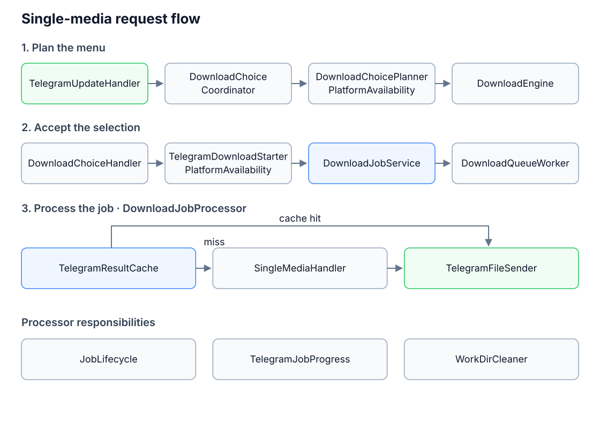
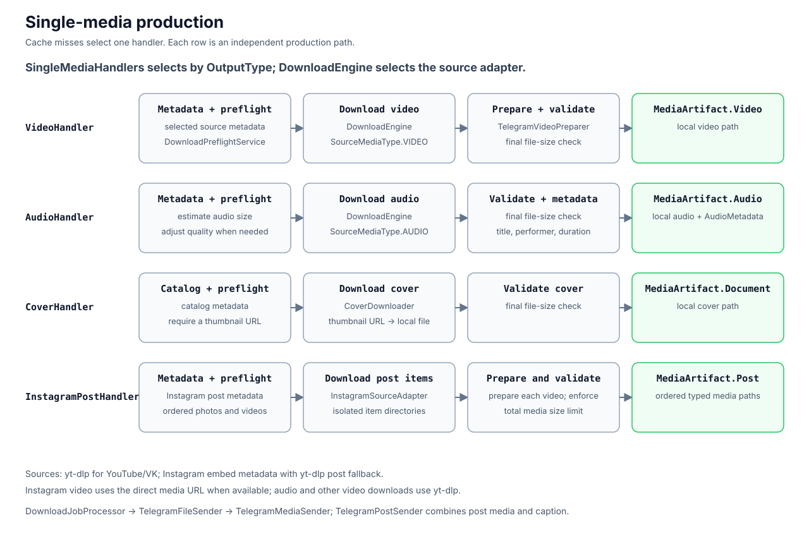
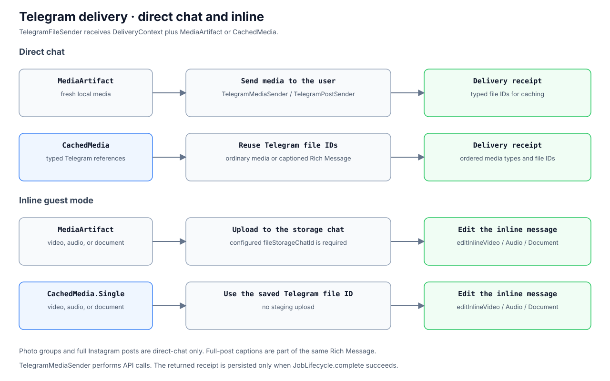
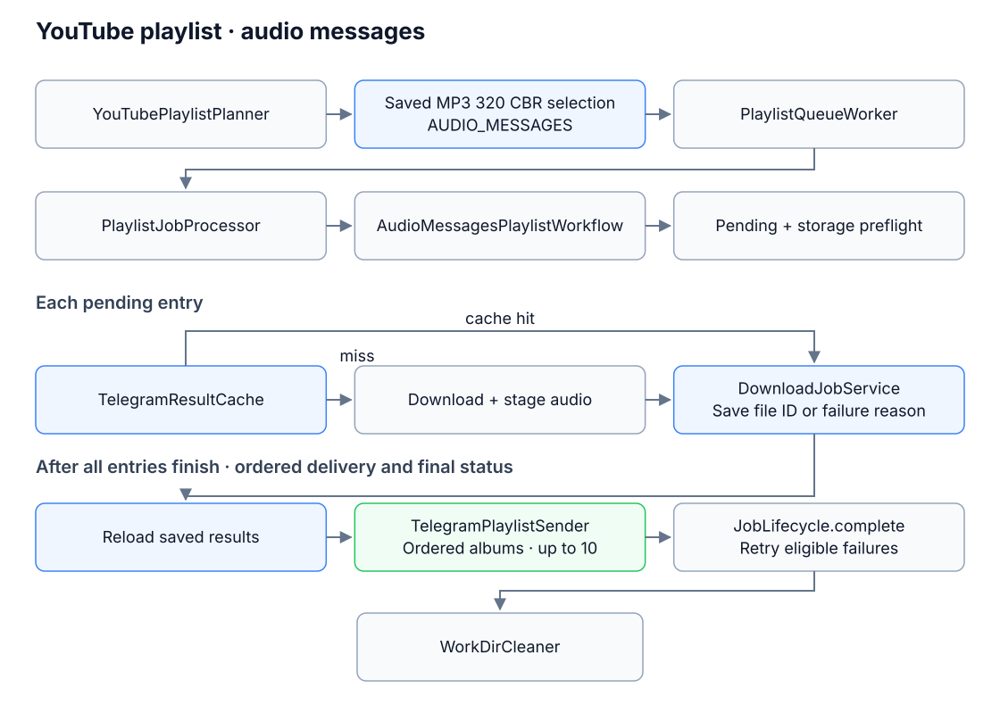
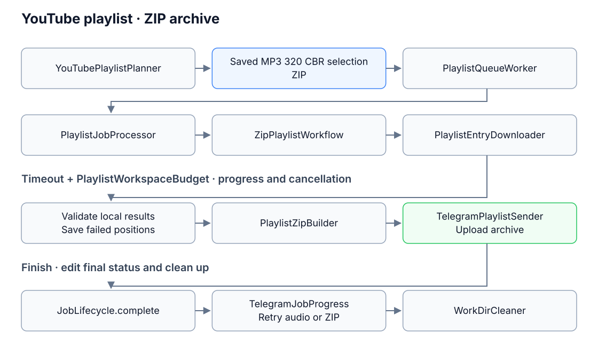
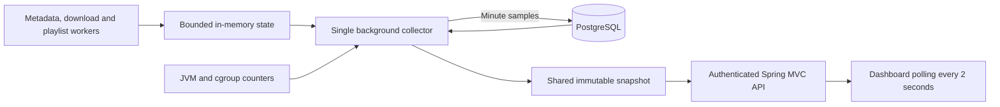

# Kradnik

Kradnik downloads public media from YouTube, Instagram, and VK to Telegram.

It supports:

- video quality, audio-only, and cover downloads;
- YouTube playlists as 320 kbps CBR MP3, in audio albums or a ZIP (up to 100 tracks);
- Instagram posts as ordered, mixed photo/video albums with captions;
- direct chats and inline guest mode; playlists and posts require a direct chat;
- cancellation of queued and running downloads;
- English, Russian, and informal Russian (“Свойский”) interfaces;
- Telegram `file_id` reuse with cloud or local Bot API.

Playlist video downloads, playlists from other platforms, private content, and authentication bypasses are not supported.

## Request flow



The diagram shows single-media jobs. Playlists use `PlaylistQueueWorker` and `PlaylistJobProcessor` with the same persisted queue. `TelegramUpdateHandler` routes requests; `DownloadChoicePlanner` and `DownloadChoiceCoordinator` prepare options and save the menu. `DownloadChoiceHandler` turns a selection into a job, which a worker claims. `DownloadEngine` delegates to yt-dlp or Instagram adapters.

- Metadata planning uses 2 threads and a queue of 32 requests. It loads formats and size estimates before enqueueing.
- Single-media yt-dlp metadata contains only fields used for options and preflight, including the needed fields from each format. Subtitle data is omitted. Metadata output has a 32 Mi-character capture limit; oversized responses fail before job creation.
- Playlists up to 100 tracks offer all tracks; larger lists offer the first or last 100. Both audio and ZIP modes use 320 kbps CBR MP3. ZIP filenames include the successful file count and playlist title; oversized archives are rejected.
- Instagram videos offer video, audio, and full-post options; static posts offer the full post. Posts support up to 20 ordered attachments. Public metadata may omit native music; Instagram login is not used.
- Available actions are green, cancellation is red, and unavailable options are hidden. Menu titles use inline monospace.
- PostgreSQL stores menus, ownership, and language so callbacks survive restarts.

### Single-media production

`DownloadJobProcessor` maps the saved selection, checks `TelegramResultCache`, then selects a handler by `OutputType`. Invalid cached Telegram references trigger a fresh download; other delivery errors fail the job. `DeliveryContext` carries the destination and post text.



| Handler | Production and validation | Result |
| --- | --- | --- |
| `VideoHandler` | Preflight, download, Telegram preparation, size check | `MediaArtifact.Video` |
| `AudioHandler` | Preflight, quality selection, download, size check | `MediaArtifact.Audio` with metadata |
| `CoverHandler` | Thumbnail lookup, download, size check | `MediaArtifact.Document` |
| `InstagramPostHandler` | Ordered mixed-media download and video preparation | `MediaArtifact.Post` |
| `ImagesHandler` | Ordered Instagram images with per-photo limits | `MediaArtifact.Photos` |

Audio preflight checks source sizes when duration estimates are missing. Instagram uses embed metadata, then yt-dlp as fallback; available media URLs download directly. Carousel fallback selects one item at a time.

### Telegram delivery



`TelegramFileSender` sends fresh files or cached Telegram references through `DeliveryContext`.

`TelegramPostSender` preserves photo/video order in ordinary albums of up to 10 items. Eleven items split 9 + 2; two albums receive `1/2` and `2/2` caption markers. Post text goes in the first caption if it fits Telegram’s 1024-character limit alongside the marker; otherwise it follows as a reply, split into 4096-character messages. Single items use `sendPhoto` or `sendVideo`. Cached posts use the same path and retain media types.

Fresh inline results first go to the storage chat; cached results reuse their file ID. Photo groups and full posts require direct chats. Delivery receipts contain reusable file IDs and are persisted only after successful job completion.

### Playlist audio messages



`PlaylistJobProcessor` runs `AudioMessagesPlaylistWorkflow`. It skips recorded results, reuses cached audio, and downloads remaining tracks in bounded parallelism. Fresh MP3 files are staged in the storage chat.

Both playlist modes prefer audio-only sources. When only combined video/audio is available, the downloader extracts audio without changing the selected bitrate or limits.

Selections persist the track range, delivery mode, and encoding. New 320 kbps jobs use a separate cache identity; older jobs retain their saved settings. Cached tracks are reused only with matching encoding. The bot saves each fresh track’s file ID after staging it.

Each track saves a file ID or error before cleanup. Successful tracks arrive in playlist order, in albums of up to 10; a lone track uses `sendAudio`. There is a one-second pause between albums. The progress message becomes the final count or failure report, with failed positions, linked titles, and localized reasons; long reports continue in separate messages. Multiple audio tracks also trigger a playback-direction hint. Restart resumes unrecorded tracks, while cancellation stops late results.

The bot checks storage-chat access before fresh downloads. Source and individual size failures skip a track; storage, disk, and delivery failures stop the job. Workspaces are cleaned after completion, failure, or cancellation.

Menu size estimates use 320 kbps and require known durations; unknown sizes are labeled without disabling either mode. Actual output enforces the upload limit. Long tracks are not trimmed or downsampled. Temporary data is limited to three upload limits, with at least 64 MiB free disk.

Progress shows counts and up to two active titles, updating at most every five seconds. A long-wait warning appears in that status for uncached work of at least 20 tracks or one hour; cached-only delivery omits it. Cancellation prevents later edits.

### Playlist ZIP



`ZipPlaylistWorkflow` downloads tracks in bounded parallelism, packages successful files, and sends the archive directly. It needs no storage chat and rebuilds local files after restart.

The saved job contains the selected range and ZIP mode. Successful tracks become local 320 kbps CBR MP3 files. Packaging and upload update the job status.

One timeout covers download, packaging, and upload. `PlaylistWorkspaceBudget` checks size and free space before and during the job; downloaded tracks and the final ZIP must each fit the upload limit. Source failures skip tracks; size, disk, and other errors abort the job. An empty result fails. Completion precedes the final status, and cleanup always runs.

### Runtime models and cache

`DownloadJob` persists work; `DownloadSpec` persists menu choices. Runtime requests separate single-media and playlist paths. `ResultKeyFactory` owns cache identities, and `TelegramReceiptCodec` preserves existing receipt formats. Saved jobs and keys remain compatible.

## Queue and lifecycle

- Run one application instance. `DOWNLOAD_WORKERS` defaults to 3, `DOWNLOAD_PLAYLIST_WORKERS` to 1, and per-playlist `DOWNLOAD_PLAYLIST_ITEM_PARALLELISM` to 2.
- PostgreSQL stores `QUEUED`, `PROCESSING`, `COMPLETED`, `FAILED`, and `CANCELLED_BY_USER` jobs. Workers claim rows with `FOR UPDATE SKIP LOCKED`; external I/O runs outside transactions.
- `JobLifecycle` makes completion and failure conditional, so cancelled jobs cannot finish later. `TelegramJobProgress` reports phases and user-facing errors. Partial playlist success counts as completion.
- Failed jobs are not retried automatically. Restart requeues interrupted work: audio playlists retain recorded file IDs, while ZIP jobs rebuild local files. Startup removes abandoned directories.
- Shutdown interrupts I/O and waits up to 30 seconds per worker pool. A crash after Telegram accepts a file but before completion can duplicate a message. Overlapping instances are unsupported.

## Embedded admin dashboard

The responsive dashboard runs inside the bot JVM and container, with Spring MVC, static assets, and no separate frontend service. It supports phones and uses authenticated Spring Security sessions with a BCrypt password.


```mermaid
flowchart LR
    Workers[Metadata, download and playlist workers] --> Runtime[Bounded in-memory state]
    Postgres[(PostgreSQL)] --> Collector[Single background collector]
    Runtime --> Collector
    JVM[JVM and cgroup counters] --> Collector
    Collector -->|Minute samples| Postgres
    Collector --> Snapshot[Shared immutable snapshot]
    Snapshot --> API[Authenticated Spring MVC API]
    API --> Browser[Dashboard polling every 2 seconds]
```

Enable with `ADMIN_ENABLED=true`, `ADMIN_USERNAME`, and `ADMIN_PASSWORD_HASH` (BCrypt cost 10–14). Generate a hash with `htpasswd -nBC 10 admin` and copy the part after `admin:`. Single-quote it in Compose `.env` to preserve `$`; keep credentials out of Git and command-line arguments.

Compose binds `127.0.0.1:${ADMIN_PUBLIC_PORT:-8080}`. Access `/admin` through an SSH tunnel (`ssh -L 8080:127.0.0.1:8080 user@server`) or HTTPS proxy; set `ADMIN_COOKIE_SECURE=true` for HTTPS. Non-Compose runs use `ADMIN_PORT` (default 8080). When disabled, access is denied and monitoring resources are not created. Invalid enabled credentials prevent startup.

For workflow deployments, set secret `ADMIN_PASSWORD_HASH` and variables `ADMIN_ENABLED`, `ADMIN_USERNAME`, `ADMIN_PUBLIC_PORT`, `ADMIN_COOKIE_SECURE` in the GitHub `production` environment. Deployment regenerates `.env`; server edits are overwritten. The renderer validates values and quotes the hash. Keep the plaintext password in a local password manager. Public HTTPS requires DNS, a reverse proxy, and a certificate; keep the app port on localhost.

Sessions expire after 15 idle minutes; at most three logins are active. Cookies are HttpOnly and SameSite=Strict, login/logout use CSRF protection, and login attempts are limited to ten per minute. Polling keeps sessions active; credential changes require a restart.

The dashboard shows:

- Worker state, current job, platform, phase, elapsed time, and playlist track activity.
- Queued/processing counts, oldest queued job, and the separate metadata queue.
- Completed, failed, and cancelled jobs over 15 minutes, one hour, and 24 hours. Partial playlists count as completed.
- Persisted metadata, playlist-item, worker-loop, and queue-rejection errors. These counters overlap with failed jobs and are not a total of all application errors.
- One hour of minute-by-minute queue history, restored after restart.

All three tables sort by headers (click, Enter, or Space), reverse on a second activation, and keep their order during refreshes. Sorting is browser-side and numeric where appropriate.

The existing collector reads JVM MXBeans and Linux cgroup v1/v2 counters roughly every six seconds. It shows heap, non-heap, cgroup usage/limit, and GC count/time changes without extra worker hooks or forced GC. GC time is approximate; cgroup usage includes child processes and file cache, not total VPS memory. Unsupported or unlimited values display as unavailable.

Memory samples persist once per minute for seven days; the UI shows the latest hour across releases, including gaps. Graceful shutdown flushes the current minute. Abrupt stops or database outages can lose recent samples; acquisition and persistence errors are shown separately and do not block workers.

`download_jobs` supplies queue and outcome statistics. `AdminStatisticsStore` persists only extra error counters and history samples.

One collector refreshes queue aggregates every two seconds and outcomes every ten seconds. HTTP requests read a cached snapshot without SQL. Monitoring uses at most one separate PostgreSQL connection, bounded by 500 ms statement/acquisition and 100 ms lock timeouts. Failed queries retain the last value and timestamp instead of showing zero; very large histories may exceed this budget.

Workers and metadata planning publish only to `BotTelemetry`; adapters and media handlers do not depend on the dashboard. `AdminQueries` isolates its job-table SQL, and the browser reads `DashboardSnapshot`. Schema changes to queried columns require matching query and PostgreSQL test updates.

Extra counters flush at most every ten seconds and on graceful shutdown. Minute-level writes are idempotent, retained seven days, and pruned hourly. Worker state restarts fresh; abrupt stops may lose counters since the last flush. Database outages retain pending counters in bounded memory for 24 hours and appear on the dashboard.

Worker instrumentation updates bounded memory without I/O. The web server allows eight request threads and 32 connections; hidden tabs pause polling, and failed requests back off. API payloads omit URLs, Telegram identities, credentials, and exception messages.

## Code map

Paths are relative to `src/main/kotlin/com/nkudrin713/kradnik/`.

| Component | Responsibility |
| --- | --- |
| `telegram/handler/TelegramUpdateHandler.kt` | Commands, links, and callbacks |
| `download/platform/PlatformResolver.kt` | URL validation, normalization, and source routing |
| `download/choice/DownloadChoicePlanner.kt`, `StandardMediaChoicePlanner.kt`, `InstagramChoicePlanner.kt`, `MediaChoiceBuilder.kt` | Planning routing, platform-specific options, shared format selection and size estimates |
| `telegram/DownloadChoiceCoordinator.kt` | Bounded metadata execution and menu publication |
| `download/service/DownloadJobService.kt` | Enqueue, claim, completion, failure, cancellation, and startup recovery |
| `download/repository/DownloadJobRepository.kt` | Queue SQL and reusable Telegram file lookup |
| `download/processing/DownloadQueueWorker.kt` | Single-media worker pool and polling loops |
| `download/processing/DownloadJobProcessor.kt` | Cache lookup, handler selection, delivery, lifecycle, and cleanup |
| `download/single/` | Video, audio, cover, and images production through `SingleMediaHandler` |
| `download/domain/DownloadRequest.kt`, `MediaArtifact.kt`, `MediaMetadata.kt` | Runtime requests, typed local results, and source-neutral metadata |
| `download/repository/DownloadRequestMapper.kt` | Saved menu/job selection to runtime request mapping |
| `download/playlist/YouTubePlaylistPlanner.kt` | Playlist metadata, track ranges, and audio options |
| `download/processing/PlaylistQueueWorker.kt`, `download/processing/PlaylistJobProcessor.kt` | Separate playlist workers and delivery-mode orchestration |
| `download/playlist/AudioMessagesPlaylistWorkflow.kt`, `ZipPlaylistWorkflow.kt` | Track processing, checkpoints or ZIP packaging, and playlist delivery |
| `download/playlist/PlaylistWorkspaceBudget.kt` | ZIP workspace size and free-space checks |
| `download/processing/JobLifecycle.kt`, `download/telegram/TelegramJobProgress.kt` | Conditional terminal transitions, progress, user-facing errors, and playlist summaries |
| `download/processing/ActiveDownloadRegistry.kt` | Running coroutine registry for user cancellation |
| `download/DownloadEngine.kt`, `download/source/` | Explicit source registry, source requests, metadata adaptation, and yt-dlp/Instagram download routing |
| `download/instagram/InstagramEmbedDownloader.kt` | Instagram metadata and media download |
| `ytdlp/YtDlpService.kt`, `ytdlp/YtDlpPresets.kt`, `process/DefaultProcessRunner.kt` | Download presets, external commands, timeouts, diagnostics, and process termination |
| `download/telegram/TelegramFileSender.kt`, `TelegramPlaylistSender.kt`, `telegram/TelegramMediaSender.kt` | Single-media and playlist delivery through the Telegram API |
| `download/telegram/TelegramResultCache.kt`, `TelegramReceiptCodec.kt`, `download/identity/ResultKeyFactory.kt` | Cache lookup, stored Telegram references, and result keys |
| `download/limit/`, `download/cover/` | Preflight/upload limits and cover downloads |
| `download/video/` | Video probing and Telegram compatibility normalization |

Runtime ownership:

- PostgreSQL stores jobs, choice sessions, and user language preferences.
- Flyway owns schema changes.
- HTTP clients are shared. Planning reads metadata before enqueueing; single-media cache misses prepare it again for preflight and download. Download processes and work directories belong to a job or playlist entry.
- PostgreSQL owns job state; `ActiveDownloadRegistry` holds running coroutine handles in memory so cancellation can reach active I/O.

## Stack

- Application: Kotlin, Spring Boot, Spring Data JPA, Java 21 executors.
- Storage: PostgreSQL and Flyway.
- Media: yt-dlp, ffmpeg, and ffprobe.
- Delivery: Telegram Bot API.
- Deployment: Docker Compose.
- Tests: JUnit, MockK, JaCoCo, and Testcontainers.
- I/O model: executor worker loops bridge to coroutines for job cancellation, parallel playlist processing, and external I/O.

## Local development

Requirements: Java 21, Docker, yt-dlp, ffmpeg/ffprobe, Deno for YouTube JavaScript challenges, and a Telegram bot token. See `Dockerfile` for the packaged media dependencies.

```bash
cp .env.example .env
# Set TELEGRAM_BOT_TOKEN in .env
APP_IMAGE=kradnik:local docker compose up -d postgres
./gradlew bootRun --args='--spring.profiles.active=local'
```

Run the complete verification:

```bash
./gradlew check bootJar
```

- `check` runs ktlint, tests, and aggregate JaCoCo coverage verification.
- PostgreSQL integration tests use Testcontainers and are skipped when Docker is unavailable.
- A successful build with skipped Testcontainers tests is not database verification.

## Configuration

- `POSTGRES_*`: database connection.
- `TELEGRAM_BOT_*`, `TELEGRAM_MAX_UPLOAD_BYTES`: Telegram endpoints and file-size limit.
- `TELEGRAM_FILE_STORAGE_CHAT_ID`: storage chat for fresh guest-mode uploads and playlist audio messages; ZIP delivery does not require it.
- `DOWNLOAD_WORKERS`: concurrent single-media jobs; default 3.
- `DOWNLOAD_PLAYLIST_WORKERS`: additional concurrent playlist jobs; default 1.
- `DOWNLOAD_PLAYLIST_ITEM_PARALLELISM`: concurrent track downloads inside one playlist; default 2.
- `DOWNLOAD_PLAYLIST_ZIP_TIMEOUT`: total ZIP job timeout, including download, packaging and upload; default `2h`. ZIP workspaces are monitored against three times `TELEGRAM_MAX_UPLOAD_BYTES` and require at least 64 MiB of free disk space. The polling guard may briefly overshoot while external processes write.
- `DOWNLOAD_WORK_DIR`: writable media directory with one subdirectory per job.
- `DOWNLOAD_*_TIMEOUT`: external-process and HTTP timeouts.
- `DOWNLOAD_YT_DLP_CLOUD_MAX_WORKSPACE_BYTES`: per-process cloud download workspace cap.
- `DOWNLOAD_CHOICE_SESSION_TTL`: retention after selection or cancellation; default 30 minutes.
- `DOWNLOAD_CHOICE_SESSION_MAX_AGE`: maximum lifetime of an unselected menu; default 30 days.
- `DOWNLOAD_CHOICE_SESSION_CLEANUP_DELAY_MS`: cleanup interval; default 600000 ms.
- `YOUTUBE_PO_TOKEN_PROVIDER_URL`: optional YouTube PO Token Provider.

Operational notes:

- Local Bot API endpoints require a media volume shared with the application; point `DOWNLOAD_WORK_DIR` to it.
- Guest mode requires BotFather enablement and permission to use the configured storage chat.
- Audio-message playlists also require access to the storage chat for uploading new tracks before ordered delivery; ZIP playlists upload the archive directly.
- Cached `file_id` values do not need an intermediate upload.
- `/language` changes the persisted user language: English, Русский, or Свойский (informal Russian). Existing choices stay unchanged. The selected language is also saved with download menus and jobs. Telegram's command menu uses the standard English/Russian descriptions.

## Docker and releases

```bash
./gradlew bootJar
mkdir -p .deploy
cp build/libs/app.jar .deploy/app.jar
docker build -t kradnik:local .
APP_IMAGE=kradnik:local docker compose up -d
```

- The image includes yt-dlp, ffmpeg, and runtime dependencies.
- Compose profiles `telegram-local` and `youtube-pot` enable optional services.
- `scripts/render-deploy-env.sh` renders production configuration.
- Merging to `main` does not deploy. A manual release builds and deploys an immutable version and image digest.
- Migration `V26` requires the old application to be stopped; mixed versions and application-only rollback are unsafe.
- Applied Flyway migrations are immutable.
